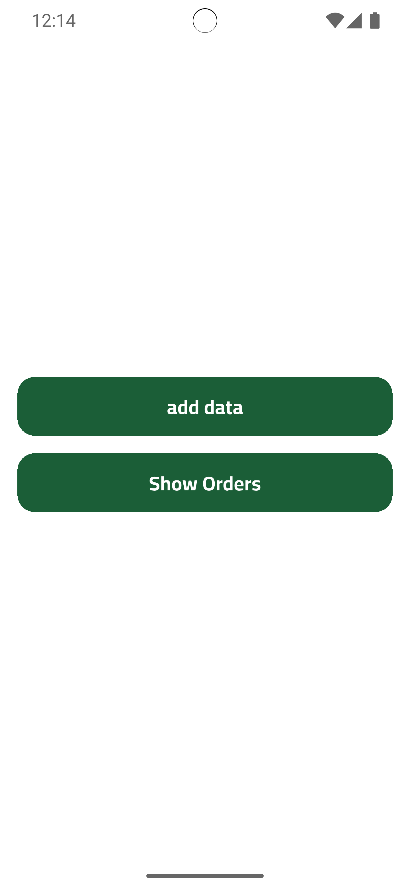
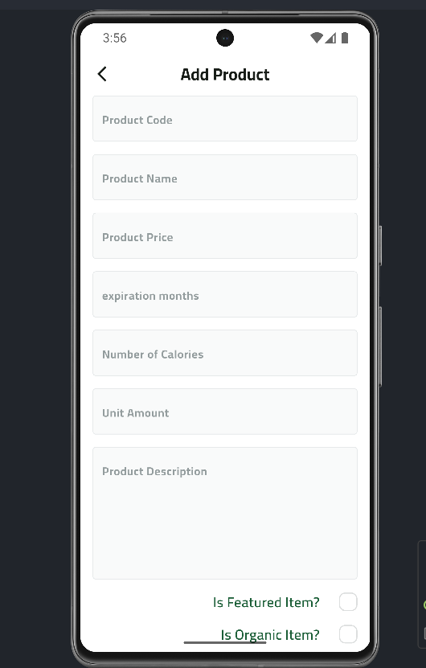
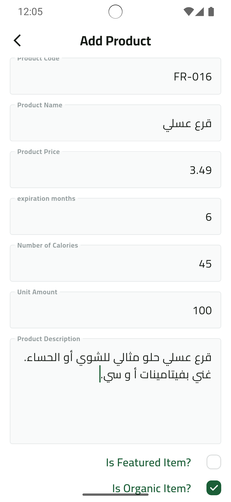
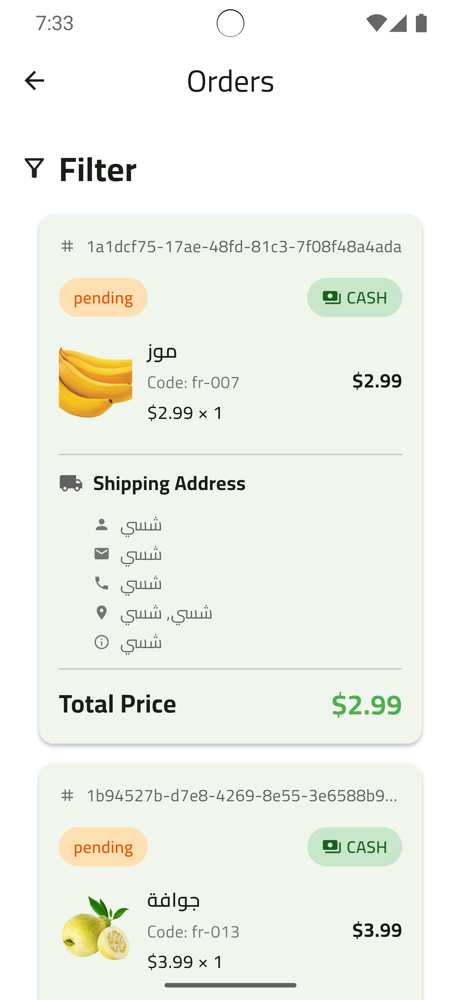

# Fruit Dashboard 🍎🍌🍊

A Flutter-based admin dashboard application for managing a fruit e-commerce platform. This dashboard allows administrators to manage products, track orders, and monitor order statuses in real-time.


## Screen Shots
<p align="center">
  
  
  
</p>

<p align="center">
  
  
</p>

## Features

### 📦 Product Management
- Add new fruit products with detailed information
- Upload product images to Supabase storage
- Set product properties (price, calories, expiration, organic status)
- Mark products as featured items
- Add product reviews and ratings

### 📋 Order Management
- View all orders in real-time
- Track order status (Pending, Completed, Canceled)
- View detailed shipping information
- Monitor payment methods (Cash/Online)
- Update order status with one click
- View product details within orders

### 🎨 UI/UX Features
- Clean and intuitive interface
- Real-time updates using Firebase Firestore streams
- Loading skeletons for better UX
- Custom form validation
- Snackbar notifications
- Image preview before upload

## Tech Stack

### Framework & Language
- **Flutter** - Cross-platform UI framework
- **Dart** - Programming language

### State Management
- **flutter_bloc** (Cubit pattern) - Predictable state management
- BLoC observer for debugging state changes

### Backend Services
- **Firebase Firestore** - Real-time NoSQL database for orders and products
- **Supabase Storage** - Cloud storage for product images

### Architecture
- **Clean Architecture** with separation of concerns:
    - **Domain Layer**: Entities and repository interfaces
    - **Data Layer**: Models, data sources, and repository implementations
    - **Presentation Layer**: UI, widgets, and Cubits

### Key Packages
- `cloud_firestore` - Firebase Firestore integration
- `supabase_flutter` - Supabase client
- `dartz` - Functional programming (Either type for error handling)
- `get_it` - Service locator for dependency injection
- `image_picker` - Image selection from gallery
- `modal_progress_hud_nsn` - Loading indicators
- `skeletonizer` - Skeleton loading animations

## Project Structure

```
lib/
├── core/
│   ├── dummy data/          # Dummy data for testing
│   ├── errors/              # Error handling (Failures, Exceptions)
│   ├── helper_functions/    # Utility functions
│   ├── repos/               # Core repositories (Image, Product)
│   ├── services/            # Services (Database, Storage, DI)
│   ├── utils/               # Constants, colors, text styles
│   └── widgets/             # Reusable widgets
├── features/
│   ├── add_product/
│   │   ├── data/           # Product models and data layer
│   │   ├── domain/         # Product entities and use cases
│   │   └── presentation/   # UI and Cubit for product management
│   ├── dashboard/          # Main dashboard navigation
│   └── orders/
│       ├── data/           # Order models and repository implementation
│       ├── domain/         # Order entities and repository interface
│       └── presentation/   # UI and Cubits for order management
└── main.dart               # App entry point
```

## Getting Started

### Prerequisites
- Flutter SDK (3.0 or higher)
- Dart SDK
- Firebase account
- Supabase account

### Firebase Collections Structure

**products** collection:
```json
{
  "name": "Fresh Strawberries",
  "code": "fruit-001",
  "price": 4.99,
  "description": "Fresh organic strawberries",
  "imageUrl": "https://...",
  "isFeatured": true,
  "isOrganic": true,
  "expirationsMonth": 1,
  "numOfCalories": 32,
  "unitAmount": 250,
  "sellingCount": 0,
  "reviews": []
}
```

**order** collection:
```json
{
  "orderId": "auto-generated-id",
  "uld": "ORD-2024-001",
  "totalPrice": 19.44,
  "status": "pending",
  "paymentMethod": "cash",
  "shippingAddressModel": {
    "name": "John Doe",
    "email": "john@email.com",
    "phone": "+1234567890",
    "address": "123 Main St",
    "city": "New York",
    "addressDetails": "Apt 4B"
  },
  "orderProducts": [
    {
      "name": "Fresh Strawberries",
      "code": "fruit-001",
      "imageUrl": "https://...",
      "price": 4.99,
      "quantity": 2
    }
  ]
}
```

## Usage

### Adding a Product
1. Navigate to the dashboard
2. Click "Add Data"
3. Fill in product details:
    - Product code
    - Product name
    - Price
    - Expiration months
    - Calories
    - Unit amount
    - Description
4. Select product image from gallery
5. Toggle featured/organic status
6. Click "Add" button

### Managing Orders
1. Navigate to the dashboard
2. Click "Show Orders"
3. View all orders with real-time updates
4. Click on order status to change it (Pending/Completed/Canceled)
5. View complete order details including:
    - Products ordered
    - Shipping address
    - Payment method
    - Total price

## Best Practices Used

- ✅ Clean Architecture with clear separation of layers
- ✅ Repository pattern for data abstraction
- ✅ BLoC/Cubit pattern for state management
- ✅ Dependency injection with GetIt
- ✅ Functional error handling with Either
- ✅ Stream-based real-time updates
- ✅ Proper resource management (stream cancellation)
- ✅ Custom reusable widgets
- ✅ Consistent code structure

## Support

For support, email: ahmeda.saber22@gmail.com.
---

Made with ❤️ Ahmed Ashraf